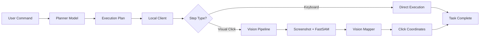
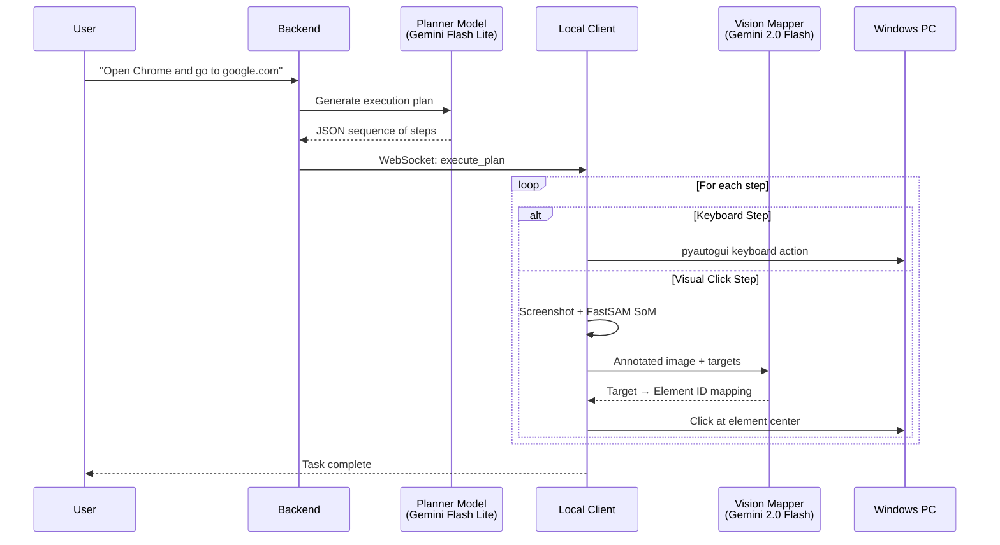
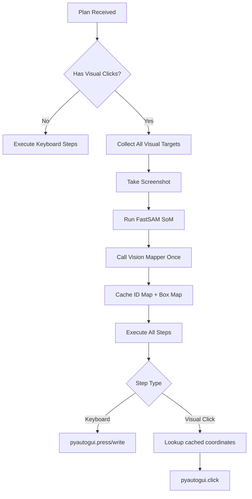
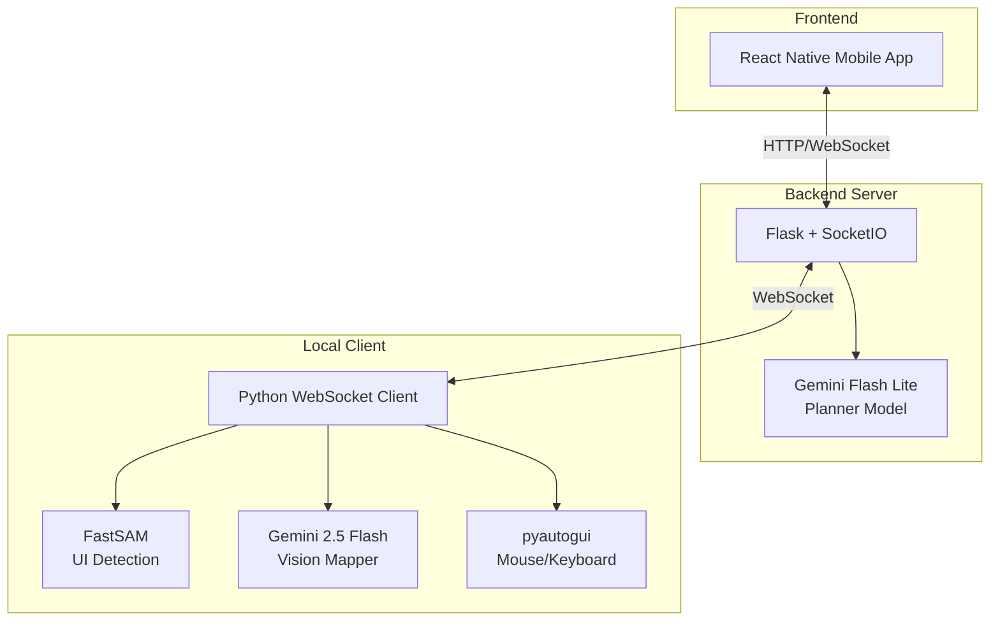
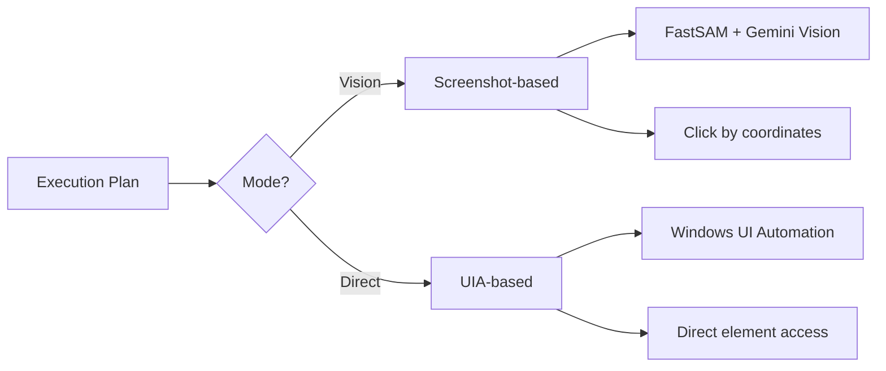
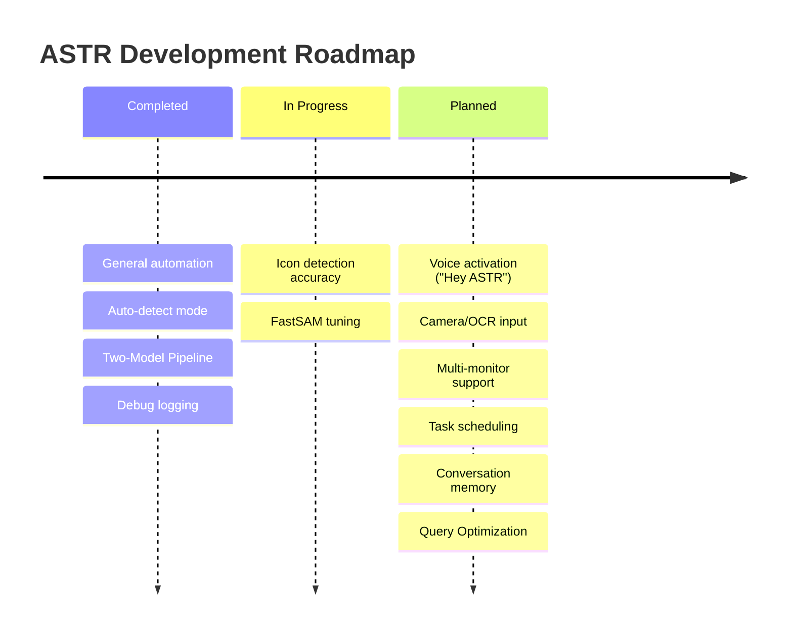

# ASTR - AI Computer Automation Assistant

## Problem Understanding

Modern computer automation faces a fundamental challenge: bridging the gap between natural language commands and precise UI interactions. Traditional automation tools require explicit scripting with exact coordinates or element identifiers, making them brittle and inaccessible to non-technical users.

Key challenges addressed:
- **Natural Language Ambiguity**: Users express tasks in varied, informal ways ("open notepad and type hello")
- **Dynamic UI Elements**: Screen layouts change based on resolution, themes, and application state
- **Visual Element Identification**: Clicking the right button requires understanding visual context
- **Cross-Application Automation**: Different apps have different UI patterns and interaction models

## Solution Approach

ASTR implements a **Two-Model Pipeline** architecture that separates task planning from visual execution:



The solution decouples:
1. **Understanding WHAT to do** (Planner Model) from
2. **Understanding WHERE to click** (Vision Mapper)

This separation allows each model to specialize, improving accuracy and maintainability.

## Technical Methodology

### Two-Model Pipeline Architecture



### Model 1: Planner (Gemini Flash Lite)

Converts natural language into structured execution plans. Supports two modes:

| Mode | Use Case | Knowledge |
|------|----------|-----------|
| General | Any computer task | Common UI patterns, keyboard shortcuts |
| FlexiSIGN | Designing/Professional Task | Plate dimensions, workflow sequences |

**Output Format:**
```json
{
  "mode": "general",
  "sequence": [
    {"order": 1, "type": "keyboard", "value": "win", "desc": "Open Start menu"},
    {"order": 2, "type": "keyboard", "value": "chrome", "desc": "Type app name"},
    {"order": 3, "type": "keyboard", "value": "enter", "desc": "Launch"},
    {"order": 4, "type": "visual_click", "target_name": "address_bar", "desc": "Click URL bar"}
  ]
}
```

### Model 2: Vision Mapper (Gemini 2.5 Flash)

Identifies UI elements in annotated screenshots. Uses Set-of-Mark (SoM) technique:

1. **FastSAM** detects all UI elements and draws numbered red boxes
2. **Vision Mapper** receives the annotated image + target list
3. Returns mapping: `{"address_bar": 45, "submit_button": 12}`

### Single-Pass Vision Architecture

For efficiency, the vision pipeline runs once per plan:



## Tools, Models & Architecture

### Technology Stack



### Component Details

| Component | Technology | Purpose |
|-----------|------------|---------|
| Mobile App | React Native + Expo | User interface for commands |
| Backend Server | Flask + Flask-SocketIO | API gateway, plan generation |
| Planner Model | Gemini 2.5 Flash Lite | NL → Execution plan |
| Vision Mapper | Gemini 2.5 Flash | Image → Element IDs |
| SoM Detection | FastSAM (Ultralytics) | UI element segmentation |
| Automation | pyautogui + pywin32 | Mouse/keyboard control |
| Communication | WebSocket | Real-time bidirectional |

### Key Files Structure

```
├── backend/
│   ├── server.py           # Flask API + WebSocket hub
│   ├── gemini_service.py   # Planner Model integration
│   └── SoM.py              # FastSAM annotation logic
│
├── local_client/
│   ├── client.py           # WebSocket client, command router
│   ├── vision_service.py   # Screenshot, SoM, Vision Mapper
│   ├── plan_executor.py    # Step execution engine
│   └── flexisign_uia.py    # FlexiSIGN-specific automation
│
└── ChatInterface/          # React Native mobile app
```

### Execution Modes

The system supports two execution strategies:



| Mode | When Used | Advantages |
|------|-----------|------------|
| Vision | General tasks, unknown UIs | Works with any application |
| Direct | FlexiSIGN, known UIs | Faster, more reliable |

## Expected Impact

### Immediate Benefits

- **Accessibility**: Non-technical users can automate complex tasks via natural language
- **Flexibility**: Works across any Windows application without pre-configuration
- **Reliability**: Two-model separation reduces hallucination and improves accuracy
- **Debuggability**: Comprehensive logging captures screenshots, plans, and mappings

### Use Cases

| Domain | Example Commands |
|--------|------------------|
| General Automation | "Open Notepad and write an essay on Automation" |
| Web Browsing | "Open Chrome and go to youtube.com" |
| FlexiSIGN | "Make iron number plate set for bike, PB12W3998" |
| File Operations | "Go to Desktop and create a new folder named Hackathon" |

### Performance Characteristics

- **Plan Generation**: ~1-2 seconds (Gemini Flash Lite)
- **Vision Pass**: ~3-5 seconds (Screenshot + FastSAM + Vision Mapper)
- **Step Execution**: ~0.3-0.5 seconds per step
- **Total Latency**: Typically 5-15 seconds for multi-step tasks

### Future Roadmap



### Debug & Troubleshooting

Each execution creates a debug folder with full traceability:

```
debug_logs/2024-12-01_16-39-33/
├── session_info.json       # Command, timestamps
├── planner_output.json     # Execution plan
├── screenshot.png          # Original capture
├── annotated.png           # SoM-marked image
├── box_map.json            # Element coordinates
├── vision_mapper_output.json # Target mappings
└── execution_log.txt       # Step-by-step log
```

This enables rapid diagnosis of:
- Planner misinterpretation
- FastSAM detection failures
- Vision Mapper misidentification
- Coordinate calculation errors
